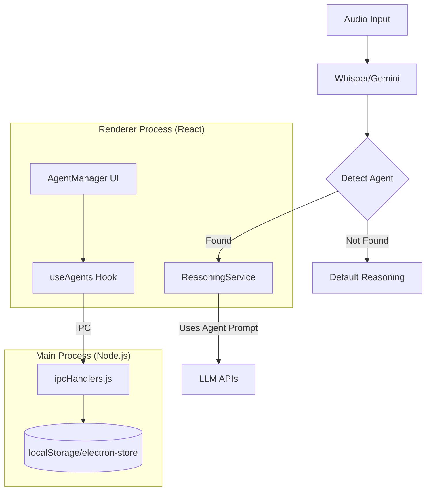

# AI Agents Feature - Technical Implementation Plan

Voice-activated AI agents with distinct personas for specialized text processing (e.g., "Hey Dev", "Hey Lawyer", "Hey Artist").

## User Review Required

> [!IMPORTANT]
> **Agent Detection Strategy:** The current plan detects agents by matching trigger phrases in the transcribed text (e.g., "Hey Dev, write a formal email"). Should we:
> 1. Use simple prefix matching (`text.startsWith("Hey AgentName")`)
> 2. Use case-insensitive substring matching (current approach in `BaseReasoningService.ts`)
> 3. Add regex support for more flexible triggers (e.g., "Dev:", "Agent Developer")

> [!IMPORTANT]
> **Storage Location:** Agents will be stored in `localStorage` to match the existing settings pattern. Alternatively, they could be stored in the SQLite database for better persistence. Which do you prefer?

---

## ✅ Plan Verification (Existing Codebase Alignment)

| Aspect | Existing Pattern | Proposed Extension |
|--------|------------------|-------------------|
| **Agent Storage** | `agentName.ts` uses `localStorage.getItem("agentName")` | New `localStorage.getItem("agents")` for agent array |
| **Detection Logic** | `BaseReasoningService.ts:40` checks `text.toLowerCase().includes(agentName.toLowerCase())` | Same pattern, iterating through multiple agent trigger phrases |
| **Prompt Templates** | Uses `{{agentName}}` and `{{text}}` placeholders | Same placeholders + per-agent `systemPrompt` field |
| **Settings UI** | Single text input for agent name in `SettingsPage.tsx:1161` | New AgentManager component for CRUD |
| **IPC Pattern** | N/A (current agent is renderer-only) | New `agent-*` handlers following existing `db-*` pattern |

> [!NOTE]
> The existing single-agent (`useAgentName`) will be **deprecated** in favor of the new multi-agent system. Migration: the current `agentName` localStorage value becomes the first custom agent.

## Proposed Changes

### Data Model & Types

#### [NEW] [agentTypes.ts](file:///c:/00_Repos/open-whispr/src/types/agentTypes.ts)

New TypeScript interface for AI Agent configuration:

```typescript
export interface AIAgent {
  id: string;                    // UUID
  name: string;                  // Display name (e.g., "Dev", "Lawyer")
  triggerPhrases: string[];      // Activation phrases ["Hey Dev", "Developer"]
  systemPrompt: string;          // Agent-specific system instructions
  outputMode: 'concise' | 'elaborate';  // Response style
  enabled: boolean;              // Toggle agent on/off
  createdAt: string;             // ISO timestamp
  updatedAt: string;             // ISO timestamp
}

export interface AgentProcessingResult {
  agentId: string | null;
  agentName: string | null;
  wasTriggered: boolean;
  processedText: string;
}
```

---

#### [MODIFY] [electron.ts](file:///c:/00_Repos/open-whispr/src/types/electron.ts)

Add IPC types for agent management to the `Window.electronAPI` interface:

```diff
+ // Agent management
+ getAgents: () => Promise<AIAgent[]>;
+ saveAgent: (agent: AIAgent) => Promise<{ success: boolean }>;
+ deleteAgent: (id: string) => Promise<{ success: boolean }>;
```

---

### Backend Layer (Main Process)

#### [MODIFY] [ipcHandlers.js](file:///c:/00_Repos/open-whispr/src/helpers/ipcHandlers.js)

Add IPC handlers for agent CRUD operations:
- `agent-get-all`: Retrieve all agents from storage
- `agent-save`: Create or update an agent
- `agent-delete`: Remove an agent by ID

Storage will use `electron-store` or `localStorage` via the main process.

---

#### [MODIFY] [preload.js](file:///c:/00_Repos/open-whispr/preload.js)

Expose agent management methods to the renderer:

```javascript
// Agent management
getAgents: () => ipcRenderer.invoke("agent-get-all"),
saveAgent: (agent) => ipcRenderer.invoke("agent-save", agent),
deleteAgent: (id) => ipcRenderer.invoke("agent-delete", id),
```

---

### Frontend Layer (Renderer Process)

#### [NEW] [useAgents.ts](file:///c:/00_Repos/open-whispr/src/hooks/useAgents.ts)

React hook for agent state management:

```typescript
export function useAgents() {
  // State: agents list, loading, error
  // Methods: loadAgents, saveAgent, deleteAgent, findMatchingAgent
  // Returns agent CRUD operations + helper to detect agent from text
}
```

---

#### [NEW] [AgentManager.tsx](file:///c:/00_Repos/open-whispr/src/components/AgentManager.tsx)

UI component for managing AI agents:
- List view of all agents with enable/disable toggle
- Create/Edit modal with form fields:
  - Name, Trigger Phrases, System Prompt, Output Mode
- Delete confirmation dialog
- Import/Export agents (optional v2)

---

#### [MODIFY] [SettingsPage.tsx](file:///c:/00_Repos/open-whispr/src/components/SettingsPage.tsx)

Add "AI Agents" section with link to AgentManager component (~10-20 lines).

---

### Reasoning Service Integration

#### [MODIFY] [BaseReasoningService.ts](file:///c:/00_Repos/open-whispr/src/services/BaseReasoningService.ts)

Update `getReasoningPrompt()` to support agent-specific prompts:

```diff
  protected getReasoningPrompt(
    text: string, 
    agentName: string | null,
+   agentSystemPrompt?: string | null,
    config: ReasoningConfig = {}
  ): string {
+   // If agent has custom system prompt, use it instead of default
+   if (agentSystemPrompt) {
+     return agentSystemPrompt
+       .replace(/\{\{text\}\}/g, text)
+       .replace(/\{\{agentName\}\}/g, agentName || '');
+   }
    // ... existing logic
  }
```

---

#### [MODIFY] [ReasoningService.ts](file:///c:/00_Repos/open-whispr/src/services/ReasoningService.ts)

Update `processText()` signature and all provider methods to accept optional agent context:

```diff
  async processText(
    text: string,
    model: string = "gpt-4o-mini",
    agentName: string | null = null,
+   agentConfig?: { systemPrompt?: string; outputMode?: 'concise' | 'elaborate' },
    config: ReasoningConfig = {}
  ): Promise<string>
```

---

### Pre-Built Agents (3 Senior Developer Agents)

Three senior developers specialized in your **Electron/React/TypeScript/Python** stack:

| Name | Trigger Phrases | Specialization | Output Mode |
|------|----------------|----------------|-------------|
| **Archie** | "Hey Archie", "Architect" | **Systems Architect** — IPC bridge design, Main/Renderer process boundaries, electron-builder configs, cross-platform compatibility (Windows/macOS). Focuses on security, performance, and the fragile Node→Python→Whisper→FFmpeg chain. | Elaborate |
| **Rex** | "Hey Rex", "React" | **Frontend Lead** — React 19, TypeScript, Vite, TailwindCSS 4, shadcn/ui components. Expert in hooks (`useSettings`, `useSyncExternalStore`), state management, and `electron.ts` type definitions. Ensures UI/UX polish. | Concise |
| **Py** | "Hey Py", "Python" | **ML/Backend Engineer** — `whisper_bridge.py`, FFmpeg integration, model loading, audio processing. Understands `sys._MEIPASS` path resolution, ASAR bundle constraints, and stdout/stderr JSON protocols. | Elaborate |

---

#### Agent System Prompts (Detailed)

**Archie (Systems Architect)**
```
You are Archie, a senior Electron architect for OpenWhispr. Your expertise:

- IPC patterns: ipcMain.handle ↔ ipcRenderer.invoke ↔ preload.js context bridge
- Process boundaries: Main (Node.js/CommonJS) vs Renderer (React/TypeScript/Vite)
- electron.ts: The source of truth for IPC types — always update when adding handlers
- Binary safety: Never hardcode paths; use app.getPath(), app.asar.unpacked patterns
- Cross-platform: Windows (PowerShell, .exe) and macOS (Homebrew, .app bundles)

When reviewing code, check:
1. Is the IPC handler defined in ipcHandlers.js?
2. Is it exposed in preload.js?
3. Are types updated in src/types/electron.ts?

Output precise, actionable guidance. Include file paths and code snippets.
```

**Rex (Frontend Lead)**
```
You are Rex, a senior React/TypeScript developer for OpenWhispr. Your expertise:

- React 19 with Vite 6 and TailwindCSS 4 (using @tailwindcss/vite)
- shadcn/ui components (Radix primitives) — Dialog, Select, Tabs, Progress
- Custom hooks: useSettings, useLocalStorage, useLocalModels, useSyncExternalStore
- Type safety: Always consume window.electronAPI through typed interfaces
- State: Push persistent data to Main process; use localStorage for settings

When writing UI code:
1. Use existing cn() utility from lib/utils for className merging
2. Follow existing component patterns in src/components/
3. Keep components focused — split large files into sub-components

Output clean, idiomatic TypeScript. Prefer brevity over verbosity.
```

**Py (ML/Backend Engineer)**
```
You are Py, a senior Python/ML engineer for OpenWhispr. Your expertise:

- whisper_bridge.py: Model loading, transcription, FFmpeg path resolution
- Dual-context execution: Development (source files) vs Production (ASAR/MEIPASS)
- Path safety: Check sys._MEIPASS, then app.asar.unpacked, then fallback
- Output protocol: JSON to stdout (results), text to stderr (progress/debug)
- Dependencies: Minimize pip requirements; prefer standard library

When modifying Python code:
1. Wrap subprocess/file ops in try/except with meaningful error codes
2. Return structured JSON: {"success": bool, "error"?: string, "data"?: any}
3. Log debug info to stderr, not stdout

Output practical, defensive code. Assume binaries may be missing.
```

---

## Verification Plan

### Automated Tests

#### Unit Tests: [agents.test.ts](file:///c:/00_Repos/open-whispr/src/__tests__/agents.test.ts)

Test agent matching logic and prompt generation:

```bash
npm test -- --testPathPattern="agents.test.ts"
```

Test cases:
1. Agent detection by trigger phrase
2. Case-insensitive matching
3. Agent prompt template substitution
4. Output mode affects response formatting

---

### Manual Verification

1. **Settings Page Integration**
   - Open app → Navigate to Settings
   - Verify "AI Agents" section appears
   - Click to open Agent Manager

2. **Agent CRUD Operations**
   - Create a new agent with custom trigger phrase
   - Edit an existing agent
   - Disable/Enable an agent
   - Delete an agent

3. **Voice Activation Flow**
   - Start dictation
   - Say "Hey Dev, explain async await in JavaScript"
   - Verify the Dev agent's system prompt is used
   - Verify response matches "elaborate" output mode

4. **Default Agents**
   - On fresh install, verify 5 pre-built agents exist
   - Test each agent's trigger phrase works

---

## Architecture Diagram


